<div align="center">

#  CodeSage

### AI-Powered GitHub Pull Request Review Platform

**Context-aware code reviews powered by Retrieval-Augmented Generation (RAG), Gemini AI, and semantic search.**

[](https://nextjs.org/)
[](https://react.dev/)
[](https://www.typescriptlang.org/)
[](https://www.postgresql.org/)
[](https://www.pinecone.io/)
[](https://ai.google.dev/)
[](https://www.inngest.com/)
[](#-license)

[🌐 Live Demo](https://codesage-ten.vercel.app) · [📂 GitHub](https://github.com/ananya1192/codesage) · [🐞 Report Bug](https://github.com/ananya1192/codesage/issues) · [💡 Request Feature](https://github.com/ananya1192/codesage/issues)

</div>

---

## Table of Contents

- [Overview](#-overview)
- [Why CodeSage Exists](#-why-codesage-exists)
- [Key Features](#-key-features)
- [Tech Stack](#-tech-stack)
- [System Architecture](#-system-architecture)
- [AI & RAG Pipeline](#-ai--rag-pipeline)
- [Background Job Flow (Inngest)](#-background-job-flow-inngest)
- [Subscription Architecture](#-subscription-architecture)
- [Database Schema Overview](#-database-schema-overview)
- [Folder Structure](#-folder-structure)
- [Getting Started](#-getting-started)
- [Environment Variables](#-environment-variables)
- [API Flow](#-api-flow)
- [Screenshots](#-screenshots)
- [Demo](#-demo)
- [Security Features](#-security-features)
- [Performance Optimizations](#-performance-optimizations)
- [Future Improvements](#-future-improvements)
- [Contributing](#-contributing)
- [License](#-license)
- [Credits](#-credits)

---

## Overview

**CodeSage** is a production-grade SaaS platform that automates GitHub pull request reviews using AI — but goes a step beyond typical "diff-in, review-out" tools.

Instead of reviewing a pull request in isolation, CodeSage **indexes the entire connected repository** into a vector database, retrieves semantically relevant context for every changed file, and feeds that context — alongside the diff — into Gemini AI. The result is a review that understands *how a change fits into the existing codebase*, not just what changed.

The platform is built with the full surface area of a real SaaS product: OAuth-based authentication, webhook-driven automation, asynchronous background processing, subscription billing, and usage metering.

> [!NOTE]
> CodeSage was built as a deep, production-oriented engineering project — prioritizing correctness (idempotency, signature verification), efficiency (incremental diff analysis), and real system design over feature count.

---

## Why CodeSage Exists

Most AI code review tools operate purely on the pull request diff. This has a fundamental limitation: **a diff has no memory of the rest of the codebase.** A reviewer (human or AI) that only sees added/removed lines can't reliably catch:

- Violations of existing patterns and conventions elsewhere in the repo
- Duplicate logic that already exists in another file
- Breaking changes to functions/interfaces used across the codebase
- Context-dependent bugs that only make sense with surrounding code

CodeSage solves this by treating the **whole repository as retrievable context**, not just the diff — giving the AI reviewer the same situational awareness a senior engineer would have when reviewing a colleague's PR.

---

## Key Features

### Authentication
- GitHub OAuth login via **Better Auth**
- Secure, encrypted session management
- Protected route middleware across the app

### Repository Management
- Connect and manage multiple GitHub repositories
- Automatic background indexing on connection
- Repository dashboard with indexing status

### AI-Powered Code Review
- Full PR review on open, **incremental diff review** on update (via GitHub Compare API)
- Context-aware RAG pipeline — not diff-only review
- Structured AI output: walkthrough, summary, issues, suggestions, sequence diagrams
- Persisted review history per repository

### Vector Search & RAG
- Automatic code chunking on indexing
- Embedding generation via `text-embedding-004`
- Vector storage and semantic retrieval via Pinecone
- Context injected into every AI review prompt

### Background Processing
- Repository indexing as an async Inngest workflow
- AI review generation as a multi-step Inngest workflow
- Reliable retries and step-level checkpointing

### Subscriptions & Billing
- Free and Pro tiers with daily AI review quotas
- Polar-powered checkout and customer portal
- Webhook-driven subscription synchronization
- Automatic upgrade/downgrade handling

### Dashboard
- Real-time repository and review statistics
- Usage monitoring against plan limits
- Subscription management UI

### Security & Reliability
- HMAC-SHA256 GitHub webhook signature verification
- Duplicate webhook delivery protection (idempotency via delivery ID)
- Per-user, per-day AI usage rate limiting

---

## Tech Stack

| Layer | Technology |
|---|---|
| **Frontend** | Next.js 16 (App Router), React 19, TypeScript, Tailwind CSS, shadcn/ui, TanStack Query |
| **Backend** | Next.js Server Actions, Prisma ORM |
| **Authentication** | Better Auth, GitHub OAuth |
| **Database** | PostgreSQL |
| **AI Model** | Gemini 2.5 Flash |
| **Embeddings** | `text-embedding-004` |
| **Vector Database** | Pinecone |
| **Background Jobs** | Inngest |
| **Payments** | Polar |
| **Deployment** | Vercel |

---

## System Architecture

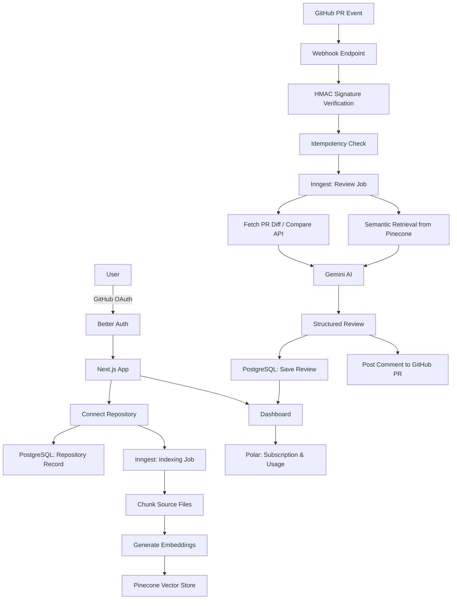

---

## AI & RAG Pipeline

CodeSage's core differentiator is treating the repository — not just the diff — as the unit of context.

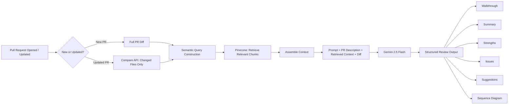

**Repository Indexing (RAG ingestion):**

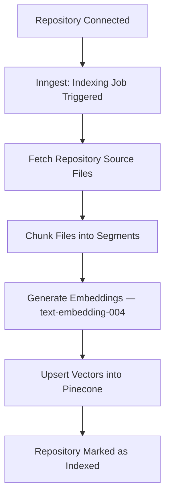

---

## Background Job Flow (Inngest)

Every review runs as a durable, multi-step Inngest workflow — decoupling long-running AI work from the GitHub webhook's short response window.

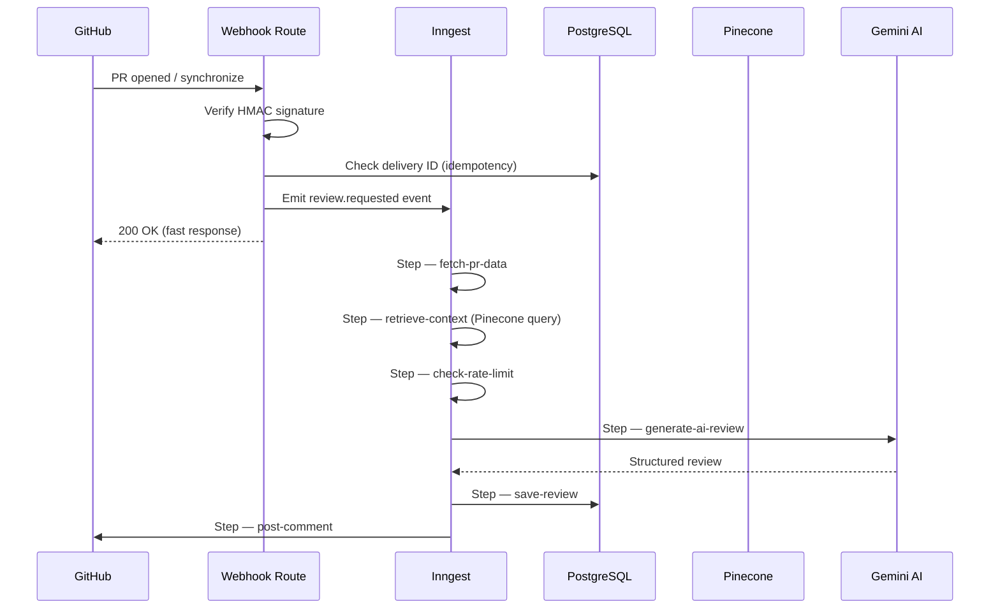

This design ensures GitHub's webhook timeout is never at risk — the webhook handler responds immediately, and Inngest reliably executes and retries each downstream step independently.

---

## Subscription Architecture

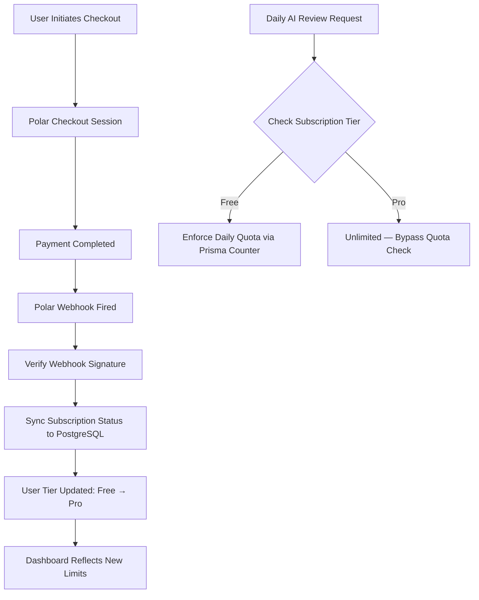

| Plan | AI Reviews / Day | Repositories | Support |
|---|---|---|---|
| **Free** | 20 | Limited | Community |
| **Pro** | Unlimited | Unlimited | Priority |

---

## Database Schema Overview

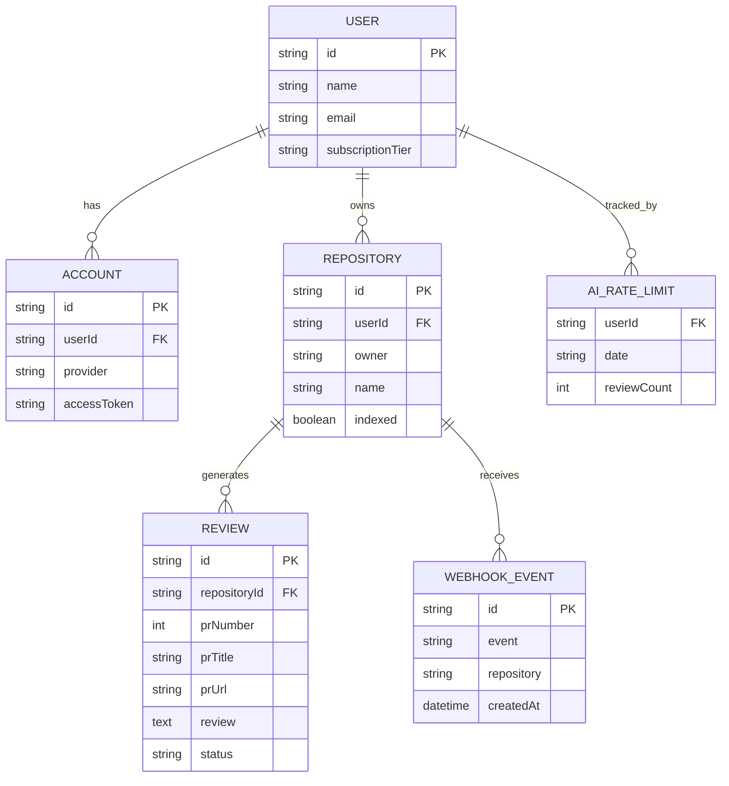

---

## Folder Structure

```
codesage/
├── app/
│   ├── api/
│   │   ├── inngest/            # Inngest serve route
│   │   ├── webhooks/
│   │   │   └── github/         # GitHub webhook handler (HMAC + idempotency)
│   │   └── auth/
│   │       └── polar/          # Polar webhook + checkout routes
│   ├── (dashboard)/            # Dashboard, repositories, reviews, settings
│   └── layout.tsx
├── inngest/
│   ├── client.ts                # Inngest client config
│   └── functions/
│       ├── index-repository.ts  # Chunking + embedding + Pinecone upsert
│       └── generate-review.ts   # Multi-step AI review workflow
├── lib/
│   ├── db.ts                    # Prisma client singleton
│   ├── github.ts                # GitHub API (Octokit) helpers
│   ├── pinecone.ts               # Vector store client
│   ├── gemini.ts                 # AI review generation
│   └── auth.ts                   # Better Auth config
├── module/
│   └── payment/
│       └── lib/
│           └── subscription.ts   # Rate limiting & subscription logic
├── prisma/
│   └── schema.prisma
├── components/                   # UI components (shadcn/ui based)                      
└── README.md
```

---

## Getting Started

### Prerequisites

- Node.js ≥ 20
- PostgreSQL database (e.g. [Neon](https://neon.tech))
- GitHub OAuth App credentials
- Pinecone account + index
- Google AI Studio API key (Gemini)
- Inngest account
- Polar account

### Installation

```bash
# 1. Clone the repository
git clone https://github.com/ananya1192/codesage.git
cd codesage

# 2. Install dependencies
npm install

# 3. Configure environment variables
cp .env.example .env
# Fill in the values — see Environment Variables section below

# 4. Push the database schema
npx prisma migrate deploy

# 5. Run the development server
npm run dev

# 6. In a separate terminal, run the Inngest dev server
npx inngest-cli@latest dev
```

Visit `http://localhost:3000` to view the app.

---

## Environment Variables

| Variable | Description |
|---|---|
| `DATABASE_URL` | PostgreSQL connection string |
| `BETTER_AUTH_SECRET` | Secret used to sign auth sessions |
| `GITHUB_CLIENT_ID` | GitHub OAuth App client ID |
| `GITHUB_CLIENT_SECRET` | GitHub OAuth App client secret |
| `GITHUB_WEBHOOK_SECRET` | Secret used for HMAC-SHA256 webhook signature verification |
| `GEMINI_API_KEY` | Google AI Studio API key for Gemini access |
| `PINECONE_API_KEY` | Pinecone API key |
| `PINECONE_INDEX` | Name of the Pinecone index used for repository embeddings |
| `INNGEST_EVENT_KEY` | Inngest event key (production) |
| `INNGEST_SIGNING_KEY` | Inngest signing key (production) |
| `POLAR_ACCESS_TOKEN` | Polar API access token |
| `POLAR_WEBHOOK_SECRET` | Secret used to verify Polar webhook payloads |
| `NEXT_PUBLIC_APP_URL` | Public URL of the deployed app |

> [!WARNING]
> Never commit `.env` files. Use `.env.example` as a template and store real secrets in your deployment platform's environment variable manager.

---

## API Flow

**End-to-end request lifecycle for a pull request review:**

1. **GitHub PR event** (`opened` / `synchronize`) is sent to `/api/webhooks/github`.
2. The handler verifies the `x-hub-signature-256` header using **HMAC-SHA256**.
3. The `x-github-delivery` ID is checked against stored `WebhookEvent` records to **reject duplicate deliveries**.
4. A `review.requested` event is emitted to **Inngest**, and the webhook responds `200 OK` immediately — decoupling processing from GitHub's timeout window.
5. Inngest executes the review workflow as independent, retryable steps:
   - Fetch PR diff (full diff for new PRs, **Compare API** diff for updates)
   - Query Pinecone for semantically relevant repository context
   - Check the user's daily AI rate limit
   - Generate the review via Gemini
   - Persist the review to PostgreSQL
   - Post the review as a GitHub PR comment
6. The dashboard reflects the new review, updated usage counters, and repository statistics in real time.

---

## Screenshots

## Authentication
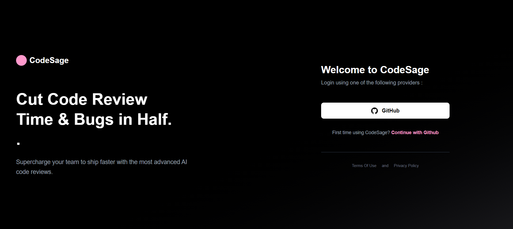

---

##  Dashboard

### Dashboard – Overview
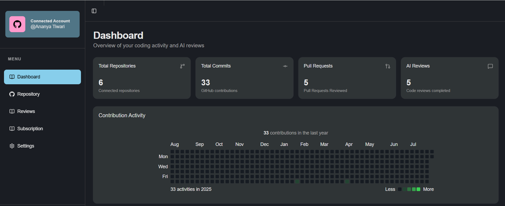

### Dashboard – Analytics & Recent Reviews
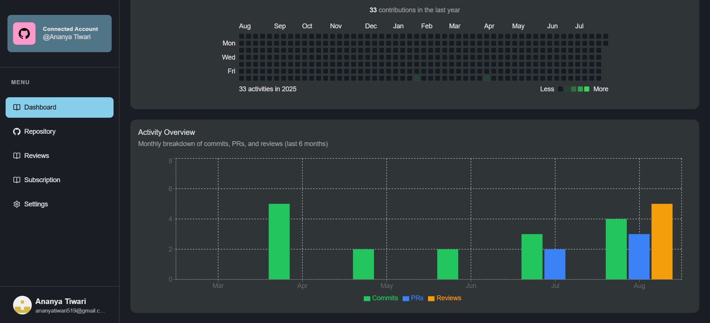

---

##  Repository Management

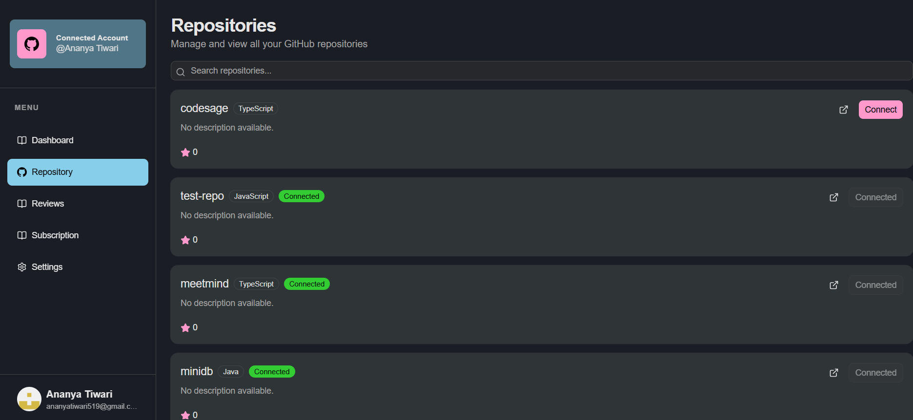

---

##  AI Review

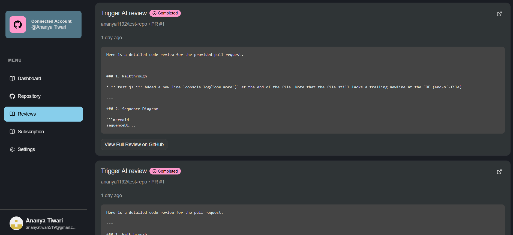

---

##  Subscription Management

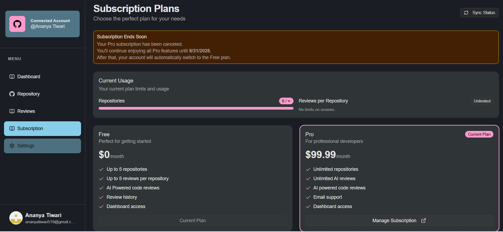

---

## Settings

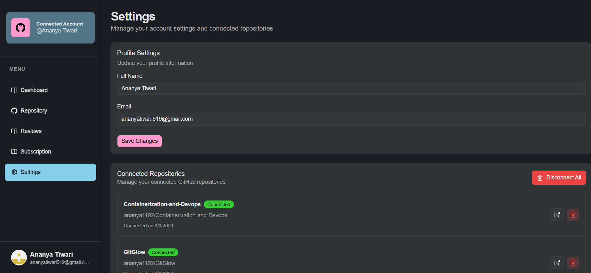

---

###  Live Demo

🔗 [https://codesage-ten.vercel.app](https://codesage-ten.vercel.app)

### GitHub Repository

🔗 [github.com/ananya1192/codesage](https://github.com/ananya1192/codesage)

---

## Security Features

- **HMAC-SHA256 webhook signature verification** — rejects any GitHub webhook payload that isn't cryptographically signed with the correct secret.
- **Webhook idempotency** — duplicate deliveries (identified via `x-github-delivery`) are detected and ignored, preventing duplicate reviews and redundant AI calls.
- **Per-user rate limiting** — daily AI review quotas enforced at the database level, checked before every AI call.
- **OAuth-based authentication** — no password storage; session security delegated to Better Auth with GitHub as the identity provider.
- **Environment-isolated secrets** — signing keys, API keys, and webhook secrets are scoped per environment (development vs. production).

---

## Performance Optimizations

- **Incremental PR diff analysis** — on PR updates, only newly changed files (via GitHub's Compare API) are re-analyzed instead of the full PR, reducing redundant context by **~76%** and LLM prompt size by **~38%**.
- **Asynchronous processing via Inngest** — AI review generation runs outside the request/response cycle, avoiding GitHub webhook timeout failures entirely.
- **Step-level checkpointing** — each Inngest step is independently memoized, so retries never re-execute already-completed work (e.g., a completed review save is never duplicated on retry).
- **Scoped vector retrieval** — Pinecone queries are filtered per repository, keeping retrieval fast and preventing cross-repository context leakage.

---

## Future Improvements

- [ ] Inline, line-anchored PR comments (GitHub Review API) instead of a single summary comment
- [ ] Redis-based sliding window rate limiting for atomic, high-concurrency usage tracking
- [ ] Support for GitLab and Bitbucket repositories
- [ ] Configurable review depth (quick pass vs. deep review) per repository
- [ ] Team/organization-level accounts with shared usage pools
- [ ] Automated test coverage for the full Inngest workflow suite

---

## Contributing

Contributions are welcome. To contribute:

1. Fork the repository
2. Create a feature branch (`git checkout -b feature/your-feature`)
3. Commit your changes (`git commit -m "Add your feature"`)
4. Push to your branch (`git push origin feature/your-feature`)
5. Open a Pull Request

Please open an issue first for major changes to discuss what you'd like to change.

---

## License

This project is licensed under the **MIT License** — see the [LICENSE](./LICENSE) file for details.

---

## Credits

Built and maintained by **[Ananya Tiwari](https://github.com/ananya1192)**.

Powered by:
- [Google Gemini](https://ai.google.dev/) for AI-generated reviews
- [Pinecone](https://www.pinecone.io/) for vector search
- [Inngest](https://www.inngest.com/) for durable background workflows
- [Polar](https://polar.sh/) for subscription billing
- [Better Auth](https://www.better-auth.com/) for authentication
- [shadcn/ui](https://ui.shadcn.com/) for UI components

---

<div align="center">

**⭐ If you find this project interesting, consider giving it a star!**

</div>
